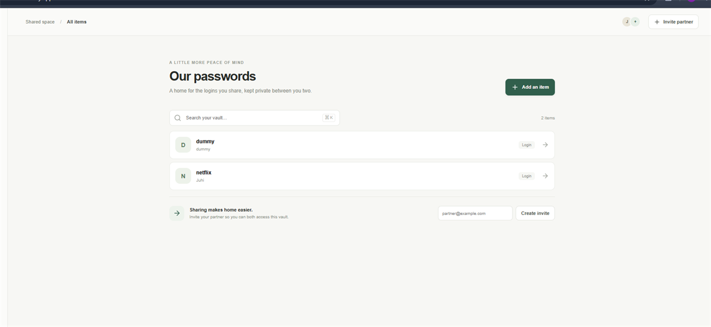
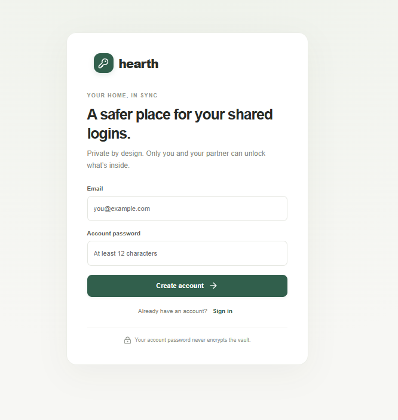
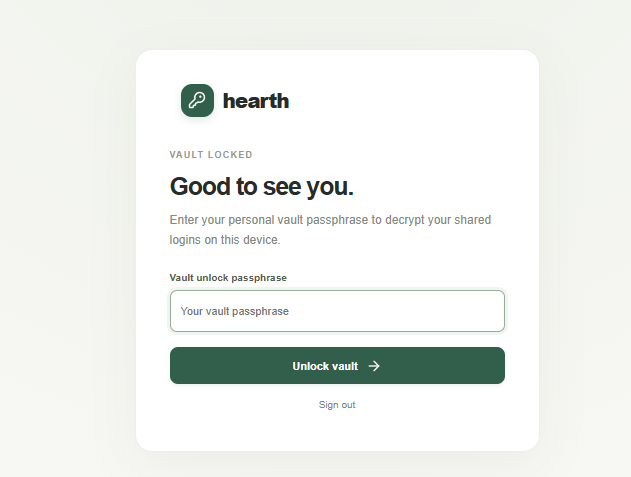
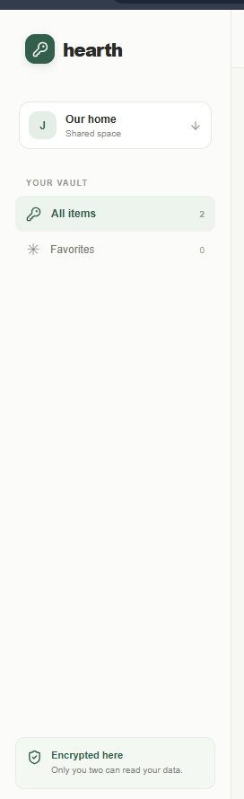
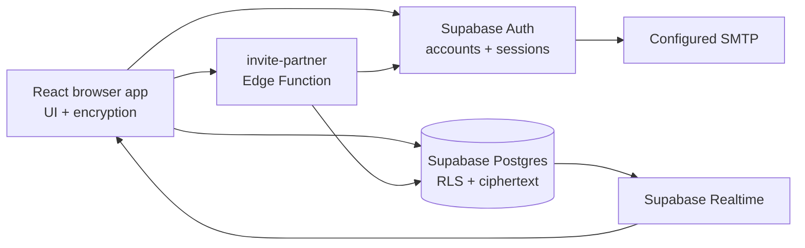

# Hearth

A private shared password vault for two people.

Hearth lets two account holders store and sync shared login details such as usernames, passwords, email addresses, and notes. Credential fields are encrypted in the browser before they are written to Supabase. Each person uses a separate account and a separate vault unlock passphrase.

## Features

- Email/password accounts through Supabase Auth
- One shared vault with a database-enforced two-member limit
- Separate unlock passphrase for each member
- Browser-side AES-256-GCM encryption for complete credential records
- Argon2id passphrase derivation with per-member salts
- Add, view, edit, delete, and search entries
- Optional descriptions and browser email validation
- Realtime entry updates between unlocked devices
- Owner-only partner invitations with encrypted vault-key envelopes
- Responsive desktop and mobile interface
- Security headers for Netlify and Vercel deployments

## Screenshots

The images below are sanitized demo screenshots. They use consistent GitHub-friendly display sizes and contain no real vault credentials.

<p align="center">
  
</p>
<p align="center"><em>Shared vault dashboard</em></p>

<table>
  <tr>
    <td align="center"><br><sub>Account creation</sub></td>
    <td align="center"><br><sub>Vault unlock</sub></td>
    <td align="center"><br><sub>Sidebar</sub></td>
  </tr>
</table>

## Architecture


### Frontend

The Vite React application in `src/` owns the screens, session state, vault state, encryption, forms, search, and realtime subscriptions. There is no separate application server or SSR layer.

### Supabase

Supabase provides authentication and Postgres access. Row Level Security (RLS) restricts vault and entry reads/writes to members. SQL functions create vaults, create invitations, accept invitations, and enforce the two-member limit. Supabase Realtime notifies clients when encrypted entry rows change.

### Invitation function

`supabase/functions/invite-partner/index.ts` verifies the signed-in caller, creates the invitation through an RPC, and asks Supabase Auth to send an account invitation email. The vault code is generated in the owner’s browser and shared separately; it is not sent to the function or placed in the email link.

## Encryption model

1. The browser generates a random 32-byte shared vault key.
2. Entry JSON is encrypted with that key using AES-256-GCM.
3. Each member’s passphrase is processed with Argon2id to derive a personal wrapping key.
4. The shared vault key is encrypted separately for each member.
5. The database stores ciphertext, IVs, encrypted key envelopes, and metadata.
6. Decryption happens only in a member’s browser after the vault is unlocked.

Current parameters include Argon2id with 64 MiB memory, three iterations, parallelism one, 16-byte salts, and fresh 12-byte AES-GCM IVs. The account password authenticates with Supabase; it is separate from the vault unlock passphrase.

Supabase can still see account and invitation metadata, vault IDs, membership, timestamps, record counts, and ciphertext sizes. The implementation has not received an independent security audit. Do not use it for production secrets without reviewing the limitations below.

## Project structure

```text
src/
  App.tsx                 Screens, state, vault operations, and realtime sync
  crypto.ts               Argon2id, AES-GCM, and key-envelope helpers
  invitations.ts          Invitation acceptance workflow
  supabase.ts             Browser Supabase client configuration
  style.css               Responsive UI styles
  main.tsx                React entry point
supabase/
  migrations/             Postgres tables, RLS, RPCs, and triggers
  functions/invite-partner/
                          Authenticated invitation email function
  config.toml             Supabase CLI configuration
public/_headers           Netlify security headers
vercel.json               Vercel build and security-header settings
tests/invitations.test.ts Local invitation regression tests
```

## Local development

### Requirements

- Node.js 22 or newer
- npm
- A hosted Supabase project
- A browser with Web Crypto and WebAssembly support

This project uses a local Vite frontend with a hosted Supabase backend. Docker is not required for the normal setup.

### Install

```bash
npm ci
```

### Configure environment variables

Copy `.env.example` to `.env.local` and add the values from the Supabase project API settings:

```dotenv
VITE_SUPABASE_URL=https://your-project.supabase.co
VITE_SUPABASE_PUBLISHABLE_KEY=your-publishable-key
```

`VITE_SUPABASE_ANON_KEY` is accepted as a legacy fallback. Values beginning with `VITE_` are included in the browser bundle, so only use public Supabase configuration there. Never put a service-role key, secret key, SMTP password, account password, or vault passphrase in this file or in Git.

### Apply the database migration

For a fresh project, run the SQL file in the Supabase SQL Editor:

```text
supabase/migrations/202609160001_shared_vault.sql
```

Or use the CLI after logging in and linking the intended project:

```bash
npx supabase login
npx supabase link --project-ref YOUR_PROJECT_REF
npx supabase db push --dry-run
npx supabase db push
```

If the SQL was already run manually, do not blindly apply it again. Confirm the schema and migration history first.

### Configure Auth URLs

For local development:

- Site URL: `http://localhost:5173`
- Redirect URL: `http://localhost:5173/**`

For a deployed site, use its HTTPS origin instead and add localhost separately when needed.

### Deploy the Edge Function

```bash
npx supabase secrets set SITE_URL=http://localhost:5173 --project-ref YOUR_PROJECT_REF
npx supabase functions deploy invite-partner --project-ref YOUR_PROJECT_REF --use-api
```

For production, set `SITE_URL` to the deployed HTTPS origin. Supabase supplies the function’s runtime URL and key dictionaries; the server secret key remains inside the Edge Function environment.

### Start the app

```bash
npm run dev
```

Open the Vite URL, usually `http://localhost:5173`.

## Email delivery

Supabase’s default email service is restricted and rate-limited. Configure custom SMTP in **Supabase → Authentication → SMTP Settings** for invitations and account emails to external addresses.

For an eligible Gmail account:

| Field | Value |
| --- | --- |
| Host | `smtp.gmail.com` |
| Port | `465` or `587` |
| Username | Full Gmail address |
| Password | Google App Password |
| Sender email | Same Gmail address |
| Sender name | `Hearth` |

Google 2-Step Verification is required before creating an App Password. Store the App Password only in Supabase SMTP settings. The invitation email carries the account link; the one-time vault code remains a separate manual handoff.

## Deployment on Netlify

### Manual deployment

The current project can be deployed as a prebuilt static site:

1. Run `npm run build` locally.
2. Open the Netlify site’s **Deploys** page.
3. Drag only `C:\projects\shared-password-manager\dist` into the upload area.
4. Wait for the production deploy to finish.
5. Open the live HTTPS URL and test signup, unlock, and invitation behavior.

Do not upload the project root or `.env` files. The `dist` folder contains the compiled frontend and the copied `public/_headers` file.

### Automatic deployment from GitHub

Connect the Netlify site to the GitHub repository under **Project configuration → Developer settings → Continuous deployment → Repository**. Set:

- Build command: `npm run build`
- Publish directory: `dist`
- Node.js: 22 or newer
- Build variables: `VITE_SUPABASE_URL` and `VITE_SUPABASE_PUBLISHABLE_KEY`

After the connection is configured, pushes to the production branch automatically build and deploy the site. Netlify build variables must be configured in Netlify; it does not read your local `.env` file.

After deploying, update Supabase with the same production origin:

- Auth Site URL: `https://your-site.netlify.app`
- Auth redirect URL: `https://your-site.netlify.app/**`
- Edge Function `SITE_URL`: `https://your-site.netlify.app`

If Netlify shows “This site is private,” change the Netlify project visibility to Public if visitors should reach Hearth’s own login screen.

## Commands

| Command | Purpose |
| --- | --- |
| `npm ci` | Install locked dependencies |
| `npm run dev` | Start the Vite development server |
| `npm run typecheck` | Type-check the frontend |
| `npm test` | Run invitation regression tests |
| `npm run build` | Type-check and create `dist/` |
| `npm run preview` | Preview the production build locally |

The test suite uses a mocked Supabase HTTP boundary and real browser crypto helpers. It does not test hosted RLS, SMTP delivery, or two-device browser sessions.

## Known limitations

- Invited users still need a complete account password setup and recovery flow.
- Member removal, ownership transfer, passphrase changes, vault-key rotation, and recovery keys are not implemented.
- Invitation codes are shared separately and are not automatically emailed.
- Favorites are temporary React state and are not synchronized.
- The whole vault is downloaded and decrypted after unlock; there is no pagination.
- Concurrent edits have no conflict resolution or history.
- Clipboard contents are not automatically cleared.
- Locking is best effort; JavaScript cannot guarantee memory erasure, and pending asynchronous work needs further hardening.
- There is no export/import flow, offline mode, MFA UI, or automated CI security gate.

## Security checklist

- Keep the GitHub repository private unless the code is intentionally public.
- Confirm `.env`, `.env.local`, `dist`, SMTP passwords, and Supabase secret keys are ignored.
- Use HTTPS for every deployed environment.
- Use a strong, unique account password and a separate strong vault passphrase.
- Never put credentials into screenshots, issue reports, logs, or test fixtures.
- Test RLS with ordinary user sessions; server secret keys bypass RLS.
- Use dummy credentials while testing deployment and invitation flows.

## License

No license file is currently included. Add an explicit license before distributing the project as open source.
