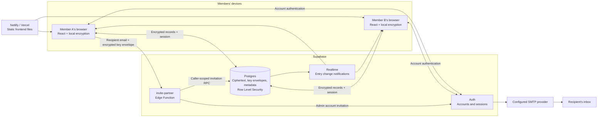
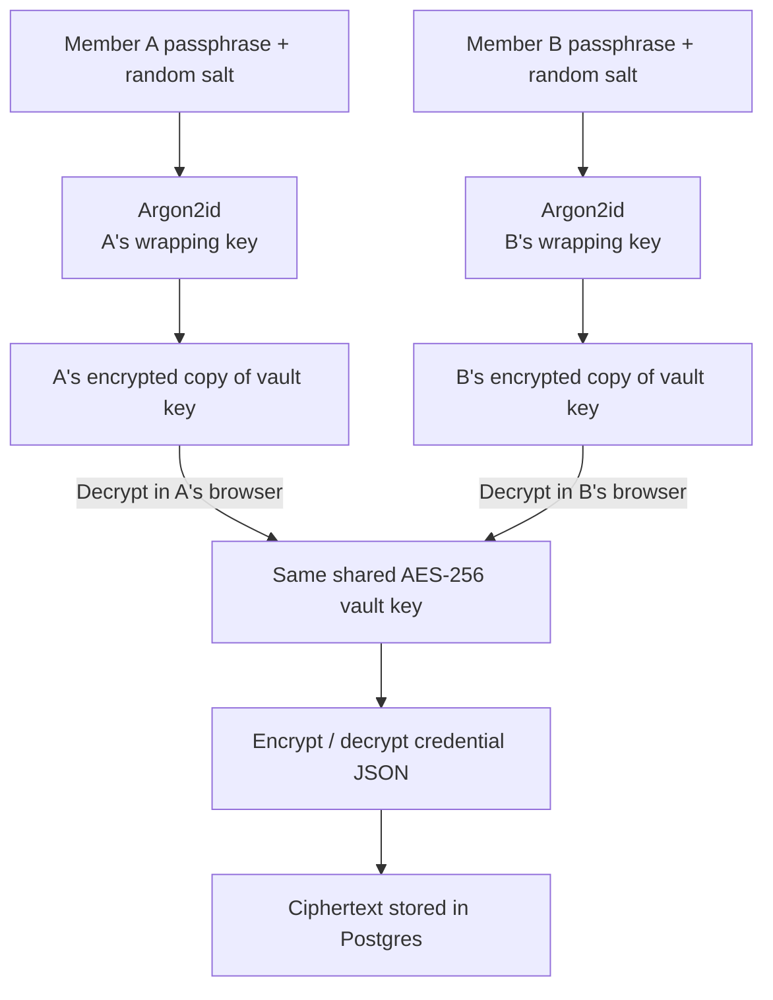
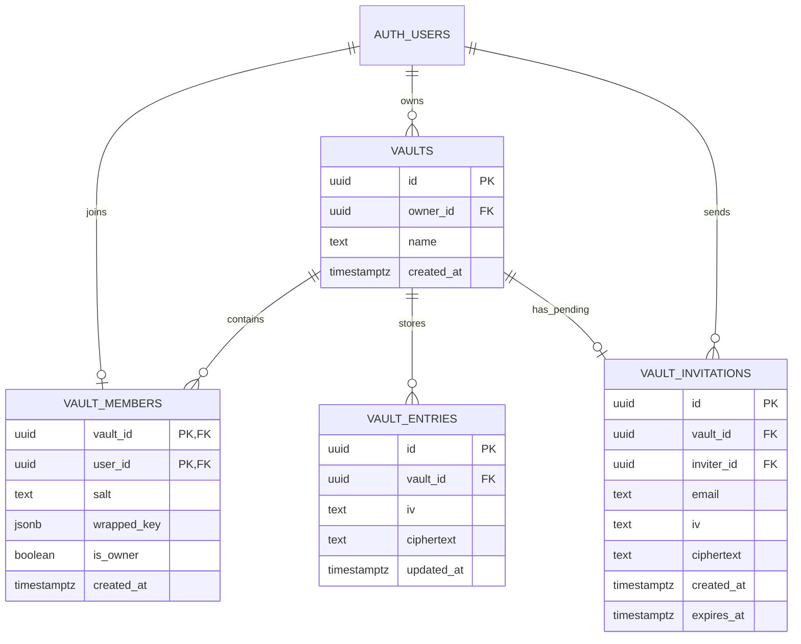

# Hearth

**A shared home for the passwords two people use together.**

Hearth is a responsive web app for storing shared login details. Each person has a separate account and a separate vault unlock passphrase. The browser encrypts credential entries before sending them to Supabase, and each member keeps an independently encrypted copy of the same shared vault key.

The project uses **React, TypeScript, Vite, Supabase Auth, Postgres, Supabase Realtime, and one Supabase Edge Function**. The frontend can be hosted as static files on Netlify or Vercel.

**Project status:** version `0.1.0`, a working prototype with known functional and security hardening gaps. Invitation acceptance establishes membership before reading protected vault metadata. Invited accounts still need an account password setup screen, and lock-state cleanup needs further hardening. Read [known limitations](#known-limitations) before treating the two-person onboarding flow as complete. This repository does not establish an independent security audit or a production readiness guarantee.

## Contents

- [What the app does](#what-the-app-does)
- [Architecture from first principles](#architecture-from-first-principles)
- [Encryption and key management](#encryption-and-key-management)
- [Database and access control](#database-and-access-control)
- [Application flows](#application-flows)
- [Interface and screenshots](#interface-and-screenshots)
- [Project structure](#project-structure)
- [Local setup](#local-setup)
- [Email delivery](#email-delivery)
- [Deployment](#deployment)
- [Development and verification](#development-and-verification)
- [Troubleshooting](#troubleshooting)
- [Known limitations](#known-limitations)
- [Roadmap](#roadmap)
- [Contributing and license](#contributing-and-license)

## What the app does

Hearth groups a household's shared credentials into one vault. Both members can read, create, edit, and delete the same entries after unlocking it. Only the owner can create the partner invitation through the normal app workflow.

| Capability | Current implementation |
| --- | --- |
| Account access | Email/password signup and sign-in through Supabase Auth |
| Vault unlocking | A personal passphrase unwraps the shared key in the browser |
| Credential management | Create, view, edit, and delete encrypted entries |
| Search | Case-insensitive filtering of decrypted name, username, email, and description |
| Password visibility | Reveal/hide controls in the editor and entry details |
| Clipboard | Copy username, email, description, invitation link, and vault code; password copying is not implemented |
| Favorites | Temporary favorites in the current page session; not saved or shared |
| Synchronization | Supabase Realtime triggers a fresh download and local decryption of entries |
| Invitations | Owner creates an encrypted invitation; Supabase attempts account invitation email delivery |
| Member limit | Database trigger and RPC checks enforce at most two members per vault |
| Locking | Manual lock on desktop and automatic lock when the page becomes hidden; see state cleanup limitations |
| Responsive layout | Desktop sidebar, compact navigation on smaller screens, and responsive forms |

Each entry contains these fields:

| Field | Purpose | Current validation |
| --- | --- | --- |
| Name | A label such as `Streaming service` | Required; leading/trailing whitespace is removed |
| Username | The service's login name | May be empty |
| Password | The credential being stored | May be empty |
| Email | The service's login or contact email | May be empty; browser email validation applies when populated |
| Description | Notes about the login | Optional |

All five fields are encrypted together. The initial product plan called for required username, password, and email fields as well; the current form requires only the name.

The two-person limit applies **per vault**. The database can hold many independent vaults, but each account can belong to only one vault.

## Architecture from first principles

### Technology choices

These are the versions resolved in the current `package-lock.json`, rather than promises to track the latest releases.

| Technology | Locked version | Role |
| --- | --- | --- |
| React | 19.3.0 | Component rendering, forms, and page state |
| TypeScript | 5.7.3 | Static checks for frontend data and code |
| Vite | 6.4.3 | Development server and production asset bundling |
| Supabase JavaScript client | 2.116.0 | Auth, database requests, function invocation, and Realtime |
| `hash-wasm` | 4.12.0 | Argon2id passphrase derivation through WebAssembly |
| Lucide React | 0.468.0 | Interface icons |
| Supabase CLI | 2.117.0 | Hosted project linking, migration commands, and function deployment |
| Browser Web Crypto | Browser API | Random bytes and AES-GCM encryption/decryption |
| Postgres and Supabase services | Hosted services | Durable records, access control, authentication, and notifications |

### The three parts of the system

1. **The browser is the interface and cryptographic workspace.** React renders the screens. Web Crypto encrypts and decrypts data. Argon2id turns an unlock passphrase into a key that can protect the vault key.
2. **Supabase is the account and storage backend.** Auth identifies the user. Postgres stores encrypted records and metadata. Row Level Security decides which records the signed-in account may access. Realtime notifies browsers about entry changes.
3. **The static host delivers the application.** Netlify or Vercel serves the HTML, CSS, and JavaScript in `dist/`. A separate Supabase Edge Function handles the privileged operation of asking Auth to email an account invitation.



The frontend talks directly to Supabase for ordinary vault operations. There is no Express server, Next.js server, ORM, or separate REST API implemented in this repository. Supabase supplies the data API; SQL policies and functions enforce the application rules.

### Responsibilities by layer

| Layer | Owns | Does not receive through the implemented vault requests |
| --- | --- | --- |
| React application | Screens, forms, session state, plaintext while unlocked, search, favorites | Server secret keys and SMTP credentials |
| Browser cryptography | Passphrase derivation, key wrapping, entry encryption/decryption | Backend administrative credentials |
| Supabase Auth | Account credentials, authentication tokens, confirmation/invitation emails | The separate vault unlock passphrase |
| Postgres and Realtime | Ciphertext, encrypted key envelopes, authorization, metadata, change events | Plaintext credential fields or the generated vault code |
| Invite Edge Function | Caller verification, invitation creation, email request | Plaintext shared vault key or vault code |
| Static host | Built application assets and response headers | Vault entries through an application storage API |

These boundaries describe the current source code. They do not protect an unlocked browser against malicious JavaScript, an untrusted extension, or a compromised device. Because the host supplies the JavaScript that handles secrets, trusting the deployed application code remains necessary.

### Authentication, authorization, and unlocking

These are three separate decisions:

- **Authentication:** Supabase verifies the account email and account password and issues a session.
- **Authorization:** Postgres checks whether that session belongs to a member of the requested vault.
- **Unlocking:** The browser uses the personal vault passphrase to decrypt the member's encrypted copy of the shared key.

A signed-in user can still have a locked vault. Restoring a Supabase session after a page refresh does not restore the in-memory vault key. Resetting an account password would not reset the vault unlock passphrase.

## Encryption and key management

The implementation lives in [`src/crypto.ts`](src/crypto.ts). It uses the browser's Web Crypto API for authenticated encryption and `hash-wasm` for Argon2id.

### The key hierarchy

Hearth generates one random key for the shared vault. Entries are encrypted with that key. Each member's personal passphrase protects a separate encrypted copy of it, called a **wrapped key** or **key envelope**.



Members do not need to know each other's passphrases. Their browsers recover the same shared key from different envelopes. This also provides a foundation for future passphrase changes by rewrapping the key, although there is no passphrase change feature yet.

### Cryptographic parameters

| Component | Value in the current implementation |
| --- | --- |
| Entry and envelope encryption | AES-256-GCM |
| Vault key | 32 bytes generated with `crypto.getRandomValues` |
| Passphrase derivation | Argon2id |
| Argon2id memory | 65,536 KiB, or 64 MiB |
| Argon2id iterations | 3 |
| Argon2id parallelism | 1 |
| Derived wrapping key length | 32 bytes |
| Per-member salt | 16 random bytes |
| GCM IV / nonce | 12 fresh random bytes per encryption |
| GCM authentication tag | Web Crypto's default 128-bit tag, included in the encrypted output |
| Stored binary encoding | Base64 for IVs, salts, and ciphertext |
| Invitation code | 32 random bytes encoded as unpadded base64url, normally 43 characters |

A **salt** ensures that the same passphrase does not produce the same wrapping key for every person. An **IV** allows the same encryption key to be used for many records with a fresh encryption operation each time. Neither is a password; both are stored alongside the encrypted material.

The invitation code already contains random key material, so the invitation envelope uses it directly as an AES key rather than running a human-password derivation step.

### What is encrypted

Before saving an entry, the browser serializes this object and encrypts it as one payload:

```json
{
  "name": "Example streaming service",
  "username": "demo-user",
  "password": "example-only-not-a-real-password",
  "email": "demo@example.com",
  "description": "Shared household subscription"
}
```

Postgres receives an entry ID, vault ID, IV, ciphertext, and timestamp. It does not receive separate readable `username` or `password` columns. An encrypted member key is stored as JSON with the shape `{ "iv": "...", "data": "..." }`; the entry and invitation tables use separate `iv` and `ciphertext` columns.

### What remains visible

Encryption does not hide account email addresses, user IDs, membership, ownership, the vault's name, invitation recipient addresses, record IDs, timestamps, approximate payload sizes, or record counts. Supabase also handles account authentication separately from the encrypted vault.

Both members may read membership records, including the other person's encrypted key envelope and salt. That does not reveal the other person's passphrase.

### The meaning of a one-time invitation

The owner generates a random code in the browser and encrypts the shared key with it. Only that encrypted key envelope is uploaded. The current account invitation email carries a redirect with an invitation ID; the code must be shared separately.

The database invitation is consumed when acceptance succeeds and expires after seven days by default. That is an application lifecycle rule. A saved copy of an envelope and its matching code can still decrypt the same underlying key later: the code does not have a built-in cryptographic expiry, and the application does not rotate vault keys.

**Automatic emailing of the vault code is not implemented in this revision.** The existing email flow sends the account invitation only.

### Security boundaries and recovery

- A copy of the database contains encrypted entries and wrapped keys. An attacker could still attempt offline guessing against weak unlock passphrases.
- Both members know the same vault key after unlocking. Removing access to the database alone would not revoke copies of data or keys already obtained. Proper member removal needs a key rotation design.
- There is no vault passphrase recovery, recovery key, or supported rewrapping workflow in the UI. The other member's access is independent, but the app does not provide a recovery process using that access.
- AES-GCM detects modification of a ciphertext under its key. The current envelopes do not bind ciphertext to a particular entry or vault ID through additional authenticated data, and do not provide application-level replay protection.
- Locking clears important React state references, but it is not a guaranteed wipe of JavaScript memory. Several cleanup and asynchronous state issues are listed below.

## Database and access control

The schema is defined in [`supabase/migrations/202609160001_shared_vault.sql`](supabase/migrations/202609160001_shared_vault.sql). Supabase supplies `auth.users`; the migration creates four tables in the `public` schema.



### Table rules

| Table | Purpose and constraints |
| --- | --- |
| `vaults` | A named vault with an owner. Names are plaintext metadata. Normal creation also creates the owner's membership. |
| `vault_members` | One wrapped key and salt per member. Composite primary key `(vault_id, user_id)` prevents duplicate membership; `unique(user_id)` limits an account to one vault. An insertion trigger caps membership at two. |
| `vault_entries` | The encrypted entry payloads. An index on `(vault_id, updated_at desc)` supports vault reads. A trigger updates `updated_at` on edits. |
| `vault_invitations` | One pending invitation per vault because `vault_id` is unique. Stores the intended email and encrypted copy of the vault key. Default expiry is seven days. |

Foreign keys use cascading deletion. In particular, deleting an owner from `auth.users` deletes their owned vault and its dependent records. There is no ownership transfer or soft-delete feature.

### Row Level Security

**Row Level Security (RLS)** applies access checks to database operations performed with a user's session. It is enabled on all four tables.

| Operation | Who is allowed by the current policies/workflow |
| --- | --- |
| Read a vault or its memberships | Existing members of that vault |
| Read, insert, update, or delete encrypted entries | Either existing member of that vault |
| Create an invitation through the RPC | The owner, while the vault has exactly one member |
| Read an invitation | Its intended recipient, matched to the authenticated email, or its inviter while still a member |
| Delete an invitation | Its inviter |
| Create a vault or join one | Authenticated callers through the controlled SQL functions |

The browser uses a publishable key, or legacy anon key, together with the user's access token. The publishable key identifies the Supabase project; it does not confer vault membership. Server secret keys bypass RLS and belong only in trusted backend environments.

### SQL functions and concurrency

An RPC is a database function called through the Supabase API. The main functions are:

| Function | Behavior |
| --- | --- |
| `is_vault_member` | Checks the current authenticated user's membership; used by RLS policies. |
| `create_vault` | Requires a signed-in account without an existing membership, then atomically creates a vault and owner membership. |
| `create_vault_invitation` | Rejects self-invitation, verifies ownership and available capacity, replaces an older invitation, and returns the new invitation ID. |
| `accept_vault_invitation` | Checks the invited email, expiry, membership, and capacity; stores the recipient's wrapped key and consumes the invitation. |
| `enforce_two_members` | A trigger function that locks the vault row and rejects an insertion once two memberships exist. |
| `touch_vault_entry` | Updates an entry's modification timestamp. |

Vault creation and invitation RPCs run with `SECURITY DEFINER`, an empty `search_path`, and explicit identity checks. Execute permission for the application RPCs is limited to `authenticated` users. Row locks serialize competing membership changes so the member limit does not rely on a frontend count.

The invitation table also has a direct INSERT grant and owner policy. The normal frontend uses the RPC, which performs additional checks and replaces old invitations; direct inserts do not inherit every RPC validation.

The acceptance RPC verifies email authorization and stores an opaque encrypted key envelope. It does not verify the vault code itself. Successful decryption in the browser proves possession of that code in the normal UI flow.

## Application flows

### First account and vault creation

1. The person signs up with an email and account password. Email confirmation depends on the hosted Supabase Auth settings.
2. After authentication, the app checks `vault_members` for the account.
3. An account with no membership and no invitation query sees the create-vault screen.
4. The person chooses a separate unlock passphrase. The current UI minimum is 12 characters.
5. The browser generates a shared key, derives a personal wrapping key, and encrypts the shared key.
6. `create_vault` stores the vault metadata and owner's encrypted key envelope.
7. The unwrapped vault key remains in page memory, ready to encrypt entries.

### Returning to a vault

The Supabase client can restore a saved account session. The app fetches membership metadata and the member's key envelope, then shows the unlock screen. A correct passphrase derives the right wrapping key and decrypts the shared key. A wrong passphrase fails authenticated decryption and displays an error.

### Adding, editing, searching, and syncing entries

Saving encrypts the entire entry in the browser before an insert or update. An edit receives a fresh IV. Deleting removes the encrypted row after a browser confirmation prompt; there is no trash or undo feature.

After unlocking, the browser downloads and decrypts the vault's entries. Search runs over that local array, so neither the search text nor searchable plaintext needs to be sent to a server. Password values are excluded from search.

The migration publishes `vault_entries` changes to Supabase Realtime. An unlocked browser listens for those events, fetches the current entries, and decrypts them again. This is a full refresh, without pagination, incremental merging, or conflict resolution. When both members edit the same entry, a later write can replace an earlier one.

### Inviting the second member

The join operation in [`src/invitations.ts`](src/invitations.ts) reads the recipient-authorized invitation first, decrypts its envelope locally, and calls the acceptance RPC before requesting member-only vault metadata. The database's existing RLS policies remain in force throughout this sequence.

```mermaid
sequenceDiagram
    participant Owner as Owner browser
    participant Fn as Invite Edge Function
    participant DB as Postgres
    participant Auth as Supabase Auth + SMTP
    participant Partner as Partner browser

    Owner->>Owner: Generate code and encrypt shared key
    Owner->>Fn: Email, vault ID, IV, encrypted key envelope
    Fn->>Auth: Verify caller session
    Fn->>DB: create_vault_invitation using caller identity
    DB-->>Fn: Invitation ID
    Fn->>Auth: Request account invitation email
    Auth-->>Partner: Email link with invitation redirect
    Fn-->>Owner: Invitation ID and email delivery status
    Owner-->>Partner: Share vault code separately
    Partner->>Auth: Authenticate as invited email
    Partner->>DB: Read invitation envelope
    Partner->>Partner: Decrypt with code; rewrap with personal passphrase
    Partner->>DB: accept_vault_invitation with new envelope
    DB-->>Partner: Membership added; invitation consumed
    Partner->>Partner: Store joined membership and unlocked key in page state
    Partner->>DB: Read protected vault metadata as a member
    DB-->>Partner: Vault metadata
```

Once the acceptance RPC succeeds, the app retains that successful join even if the subsequent metadata request fails. It displays guidance to reload rather than treating the consumed invitation as a failed acceptance. After reloading, the recipient can unlock using their chosen vault passphrase. Invited users still need a supported account password setup flow for future password-based sign-ins; see [known limitations](#known-limitations).

Creating another invitation replaces the pending invitation for that vault. Its old ID can no longer be accepted. The new envelope is associated with a newly generated code.

### Invitation endpoint reference

Implementation: [`supabase/functions/invite-partner/index.ts`](supabase/functions/invite-partner/index.ts).

```text
POST https://<project-ref>.supabase.co/functions/v1/invite-partner
Authorization: Bearer <signed-in-user-access-token>
apikey: <project-publishable-key>
Content-Type: application/json
```

The frontend's `supabase.functions.invoke` call supplies the request through the Supabase client. The body has this shape; placeholders below are illustrative, not a usable invitation:

```json
{
  "email": "partner@example.com",
  "vault_id": "<vault-uuid>",
  "iv": "<base64-iv>",
  "ciphertext": "<base64-encrypted-vault-key>"
}
```

The function uses two clients: a caller-scoped client for the invitation RPC, and a privileged client for `auth.admin.inviteUserByEmail`. Its redirect is `SITE_URL/?invite=<invitation-id>`.

| Response | Meaning |
| --- | --- |
| `200`, `{ "invitation_id": "...", "email_sent": true }` | Invitation exists and the Auth email call reported success. This does not prove inbox delivery. |
| `200`, `{ "invitation_id": "...", "email_sent": false, "email_error": "..." }` | Invitation exists but email sending failed; the UI offers a manual link/code fallback. |
| `400` | Invalid request details or a rejected invitation RPC. |
| `401` | Missing or invalid user authentication. |
| `405` | Unsupported HTTP method. `OPTIONS` is supported for browser preflight. |
| `500` | Includes the explicit missing-`SITE_URL` case; other unhandled runtime failures can also fail the request. |

Email failure does not roll back the database invitation. The frontend displays a general delivery warning; the endpoint response includes the provider's error for diagnosis. The function currently permits all origins in its CORS response; authentication and database authorization still apply.

### Locking and signing out

Manual lock clears the shared key reference, decrypted entries, selected entry, edit draft, and unlock passphrase from React state. Hiding the page, such as switching tabs, triggers the same lock behavior. Signing out also clears the invitation code and favorites when the Auth sign-out event arrives.

This is best-effort state cleanup. Manual/visibility locks currently leave the invitation code and some form state in memory, and certain pending asynchronous operations can update state after locking. The UI hides vault screens while locked, but these gaps require fixes before claiming complete decrypted-state cleanup. The clipboard is not automatically cleared.

## Interface and screenshots

| Screen | What it communicates |
| --- | --- |
| Account creation / sign-in | Account email and password, separate from vault encryption. |
| Create / join vault | A personal unlock passphrase; joining additionally asks for the vault code. |
| Locked vault | Authentication has succeeded, but credentials remain unavailable until local unlocking. |
| Shared dashboard | Entry list, local search, item editor, and partner invitation form. |
| Sidebar | All items, temporary favorites, account identity, and desktop lock/sign-out controls. |

The interface uses a muted green and cream palette, rounded cards, and Lucide icons. CSS breakpoints at 760px and 430px simplify navigation and forms. At narrow widths the manual lock button is hidden; automatic visibility locking and sign-out remain available.

For adding repository images, see the [screenshot publishing guide](docs/screenshots/README.md). Use demo records and account details when capturing screenshots for GitHub.

## Project structure

```text
shared-password-manager/
|-- src/
|   |-- main.tsx                   React entry point and global stylesheet import
|   |-- App.tsx                    Screens, state, forms, vault operations, and sync
|   |-- crypto.ts                  Argon2id, AES-GCM, and key envelope helpers
|   |-- invitations.ts             Ordered invitation acceptance and join recovery
|   |-- supabase.ts                Browser client and environment configuration
|   `-- style.css                  Interface styling and responsive breakpoints
|-- tests/
|   `-- invitations.test.ts        Local invitation regression tests
|-- supabase/
|   |-- config.toml                Generated local Supabase configuration
|   |-- functions/
|   |   `-- invite-partner/
|   |       `-- index.ts           Authenticated invitation and email function
|   `-- migrations/
|       `-- 202609160001_shared_vault.sql
|                                 Tables, RLS, RPCs, triggers, Realtime publication
|-- public/
|   `-- _headers                   Netlify HTTP security headers
|-- docs/
|   `-- screenshots/README.md      Screenshot capture and embedding guide
|-- .env.example                   Public frontend configuration template
|-- .gitignore                     Excludes dependencies, builds, and env files
|-- .vercelignore                  Vercel upload exclusions
|-- index.html                     HTML shell, metadata, and noindex directive
|-- package.json                   Dependency declarations and npm commands
|-- package-lock.json              Resolved dependency versions
|-- tsconfig.json                  TypeScript project references
|-- tsconfig.app.json              Strict frontend TypeScript settings
|-- vercel.json                    Vercel build settings and HTTP headers
|-- vite.config.ts                 Vite configuration with the React plugin
`-- README.md
```

`App.tsx` keeps the screens and most initial application state in one component; `invitations.ts` separates the join operation for focused testing. Rendering is controlled by configuration, session, membership, and key state. There is no routing library; the root URL plus the `?invite=` query selects the invitation flow.

## Local setup

### Prerequisites

- Node.js **22.6 or newer**, npm, and Git. The lockfile's Supabase JavaScript dependency requires Node 22 or newer; the test command additionally uses Node's TypeScript stripping support, available from 22.6. Node 24 also meets these requirements.
- A hosted Supabase project and permission to apply its schema/configure Auth.
- A browser with Web Crypto and WebAssembly support.
- An SMTP sender for account confirmation and invitation delivery beyond Supabase's restricted default service.

The documented development setup runs **Vite locally with a hosted Supabase backend**. It does not require Docker. The Supabase CLI is already included as a development dependency.

### 1. Get the source and install dependencies

Clone your copy of the repository and open its directory. From that directory:

```sh
npm ci
```

Use the committed lockfile to install reproducible versions. On Windows PowerShell, if execution policy blocks npm's PowerShell shim, use `npm.cmd` and `npx.cmd` for the commands in this guide.

### 2. Configure the frontend

Copy [`.env.example`](.env.example) to `.env.local` in the project root:

```powershell
# PowerShell
Copy-Item .env.example .env.local
```

```sh
# macOS / Linux
cp .env.example .env.local
```

Fill in your project's values:

```dotenv
VITE_SUPABASE_URL=https://your-project.supabase.co
VITE_SUPABASE_PUBLISHABLE_KEY=your-project-publishable-key
```

The URL and publishable key are available in your Supabase project's connection/API settings. The older variable `VITE_SUPABASE_ANON_KEY` is also accepted as a fallback. If both key variables exist, the publishable-key variable takes precedence.

Vite also loads `.env`; use one source of truth so an old `.env.local` does not override a new value in `.env`. Restart the dev server after changes. Frontend environment values are built into browser assets, so put only public configuration under `VITE_` names. [Vite environment documentation](https://vite.dev/guide/env-and-mode).

Never add a Supabase server secret key, service-role key, SMTP password, account password, or unlock passphrase to frontend configuration. `.gitignore` excludes `.env` and `.env.*`, while allowing `.env.example`.

### 3. Create the database schema

For a fresh hosted project, choose either the Supabase SQL editor or the CLI.

**SQL editor:** open [`supabase/migrations/202609160001_shared_vault.sql`](supabase/migrations/202609160001_shared_vault.sql), paste its contents into your project's SQL editor, and execute it once.

**CLI:** authenticate, link the target project, preview the migration, then apply it:

```sh
npx supabase login
npx supabase link --project-ref YOUR_PROJECT_REF
npx supabase db push --dry-run
npx supabase db push
```

These commands affect the linked hosted project. Check the target before applying migrations. If the SQL was already executed manually, skip the fresh-project `db push`: migration history may not record that manual execution, and the initial migration is not safe to blindly run twice. Reconcile the recorded migration history after confirming the existing schema matches. [Supabase environment and migration guidance](https://supabase.com/docs/guides/deployment/managing-environments).

The migration creates the four vault tables, activates their RLS policies, installs the member-limit and timestamp triggers, and adds entries to the Realtime publication.

### 4. Configure Supabase Auth

Enable email/password authentication and choose the desired email confirmation and server-side password policies. The UI requires 12 characters at signup, but the hosted account password policy must be configured separately.

For a dedicated development project, configure these Auth URL settings:

| Setting | Development value |
| --- | --- |
| Site URL | `http://localhost:5173` |
| Allowed redirect URLs | `http://localhost:5173/**` |

For a project also serving a deployed app, keep its Site URL on the production address and add localhost to the redirect allowlist as needed. Avoid switching production defaults just to test locally. See [Supabase redirect URL configuration](https://supabase.com/docs/guides/auth/redirect-urls).

### 5. Deploy the invitation function

After CLI login and project linking, configure the app origin and deploy:

```sh
npx supabase secrets set SITE_URL=http://localhost:5173 --project-ref YOUR_PROJECT_REF
npx supabase functions deploy invite-partner --project-ref YOUR_PROJECT_REF --use-api
```

Use a development project for the localhost value. On a shared production backend, `SITE_URL` should remain the deployed HTTPS origin. `--use-api` bundles the function server-side without requiring Docker. The function reads `SITE_URL` when building invitation redirects. [Supabase function deployment guide](https://supabase.com/docs/guides/functions/deploy).

The function expects these runtime variables:

| Variable | Source |
| --- | --- |
| `SITE_URL` | You configure the frontend origin, with no invitation query. |
| `SUPABASE_URL` | Supabase's default runtime environment. |
| `SUPABASE_PUBLISHABLE_KEYS` | Supabase's JSON key dictionary; the function selects `default`. |
| `SUPABASE_SECRET_KEYS` | Supabase's server-side JSON key dictionary; the function selects `default`. |

The backend function currently expects the key dictionaries; it does not implement the frontend's legacy-key fallback. Check their availability if using a different runtime or local stack. Updates to hosted function secrets become available without redeploying the function. [Supabase environment variable reference](https://supabase.com/docs/guides/functions/secrets).

### 6. Configure email delivery and start the app

Complete [email delivery](#email-delivery), then run:

```sh
npm run dev
```

Open the URL printed by Vite, normally `http://localhost:5173`. If Vite selects another port, update relevant development redirects accordingly.

Create an account, confirm its email if required, choose a separate vault passphrase, and add a dummy entry. Use separate browser profiles or devices for member testing, and account for the remaining invited-account password setup limitation described in this README.

### Optional: a fully local Supabase stack

`supabase/config.toml` is generated local development configuration, not a record of the hosted dashboard settings. A complete Docker-based local setup is not finished in this repository:

- Its Auth URL defaults still use port 3000 rather than Vite's default 5173.
- Local email confirmations are disabled, and the local account password minimum is six characters.
- The seed configuration references `supabase/seed.sql`, which is not present.
- Local mail capture differs from sending emails through a real SMTP provider.
- Edge Function key dictionaries and `SITE_URL` need to be available in the chosen local runtime.

Adjust and validate those settings before documenting `supabase start` as a fully supported alternative.

## Email delivery

### What Supabase sends

The Edge Function calls `inviteUserByEmail`; Supabase Auth delivers that email through the SMTP provider configured in the Supabase dashboard. The same Auth email configuration also serves account confirmation and other enabled Auth email flows.

The frontend contains no SMTP credentials. A successful save of SMTP settings is configuration, not a delivery test. Supabase's default mail service restricts recipients and sending volume; use custom SMTP for real external recipients. [Supabase SMTP setup](https://supabase.com/docs/guides/auth/auth-smtp).

### Gmail SMTP example

For a Gmail account eligible for App Passwords, first enable Google 2-Step Verification and generate an App Password for the application. Some account policies and Advanced Protection settings prevent App Password creation. See [Google's App Password guidance](https://support.google.com/accounts/answer/185833).

In **Supabase → Authentication → SMTP Settings**, enable custom SMTP and use:

| Field | Example |
| --- | --- |
| Sender email | Your sending Gmail address |
| Sender name | `Hearth` |
| Host | `smtp.gmail.com` |
| Port | `465` |
| Username | The same full Gmail address |
| Password | The generated Google App Password |
| Minimum interval per user | `60` seconds is an example starting value |

Supabase documents Google SMTP on ports 465 or 587 for `smtp.gmail.com`. Keep the sender and SMTP account aligned. [Supabase Google SMTP guide](https://supabase.com/docs/guides/troubleshooting/using-google-smtp-with-supabase-custom-smtp-ZZzU4Y).

Store the App Password in the dashboard's SMTP password field. It does not belong in the frontend `.env`, repository, screenshots, or an invitation message. Google revokes App Passwords when the Google account password changes; if that happens, generate a replacement and update Supabase.

### Check delivery

From an unlocked owner account, create one invitation to an eligible test recipient. Check the app's delivery message, recipient inbox/spam folder, and Supabase Auth/Function logs if sending fails. Check for rate limits before retrying. Email delivery, vault joining, and later account sign-in are separate tests; invited-account password setup is still missing in this revision.

The copyable `/?invite=<id>` URL is a reference to the vault invitation, not an authentication token. If the account email fails, the recipient must still be able to authenticate as the invited address before the fallback link can be used.

## Deployment

Deployments have three independently managed parts: **frontend assets**, **database migrations**, and **the Edge Function with its settings**. Uploading the frontend does not apply SQL or redeploy the function.

### Build the frontend

```sh
npm run build
```

The command checks frontend TypeScript and writes static assets to `dist/`. Confirm the intended Supabase project configuration is present during this build. A build that omits the environment values shows the configuration screen when opened.

### Netlify

For a manual deployment, build locally and upload only **`dist/`** through [Netlify Drop](https://app.netlify.com/drop) or the existing project's production deployment area. The folder contains `index.html`, compiled assets, and the copied `_headers` file. Updating an existing project uses its deployment upload area to retain the same site. [Netlify Drop guide](https://docs.netlify.com/start/quickstarts/netlify-drop-quickstart/).

For a Git-connected deployment, connect your repository and configure:

| Build setting | Value |
| --- | --- |
| Build command | `npm run build` |
| Publish directory | `dist` |
| Node version | 22.6 or newer; Node 24 is also supported |
| Frontend environment | `VITE_SUPABASE_URL` and `VITE_SUPABASE_PUBLISHABLE_KEY` |

Manual uploads already contain their frontend configuration. Changing environment settings in a hosting dashboard does not rewrite an old uploaded bundle; build and deploy again. Do not upload the whole working directory or its local `.env` files.

If visitors see **“This site is private”**, Netlify is requiring its own account login before the app loads. Set production project visibility to Public if the site should show Hearth's login to anyone with its URL: **Project configuration → General → Visitor access → Project visibility**. App authentication and vault authorization remain separate. [Netlify project visibility](https://docs.netlify.com/manage/security/secure-access-to-sites/project-visibility/).

### Vercel

[`vercel.json`](vercel.json) provides the Vite preset, `npm run build`, `dist` output, and response headers. Add the two public frontend environment variables to the host before building. Any privileged Supabase or SMTP credentials remain configured with Supabase.

### Connect the deployed origin

After the frontend has an HTTPS URL, configure the hosted Supabase project:

| Setting | Example |
| --- | --- |
| Auth Site URL | `https://your-site.netlify.app` |
| Auth allowed redirect | `https://your-site.netlify.app/**` |
| Edge Function `SITE_URL` | `https://your-site.netlify.app` |

The wildcard example is scoped to your own site; use more specific redirect entries where appropriate. Update the Edge Function origin with:

```sh
npx supabase secrets set SITE_URL=https://your-site.netlify.app --project-ref YOUR_PROJECT_REF
```

Use the actual deployment origin consistently, including its scheme and hostname. `localhost` refers to the person opening the link's own device, so invitation emails for another person must lead to the hosted address.

### Hosting headers

[`public/_headers`](public/_headers) for Netlify and [`vercel.json`](vercel.json) define matching protections:

| Header | Purpose in this app |
| --- | --- |
| Content Security Policy | Restricts resource origins, permits WebAssembly execution needed by Argon2id, and allows Supabase HTTPS/WebSocket connections. |
| `X-Content-Type-Options: nosniff` | Prevents browsers from guessing alternate content types. |
| `X-Frame-Options: DENY` and CSP `frame-ancestors 'none'` | Prevent framing the app. |
| `Referrer-Policy: no-referrer` | Avoids sending page addresses as referrer headers. |
| Permissions Policy | Disables camera, microphone, and geolocation access. |

CSP currently permits connections to `*.supabase.co`. A custom Supabase domain needs corresponding policy changes. Other hosting providers must be configured to serve equivalent headers; Vite's local servers do not implement Netlify's `_headers` rules. The `noindex,nofollow` metadata asks search engines not to index the site; it is not access control.

## Development and verification

### Available commands

| Command | Purpose |
| --- | --- |
| `npm ci` | Install the versions in the lockfile. |
| `npm run dev` | Start Vite; by default port 5173, listening on all interfaces. |
| `npm run typecheck` | Check the frontend TypeScript project. |
| `npm test` | Run local invitation regression tests using Node's built-in test runner. |
| `npm run build` | Type-check the frontend and create the production bundle. |
| `npm run preview` | Serve the built bundle for local inspection, normally on port 4173. |

The current build was checked while preparing this documentation using Node.js 24.13.0. A successful build does not test hosted Auth, SMTP, SQL policies, invitation acceptance, or real device synchronization. `tsconfig.app.json` includes `src`; it does not type-check the Deno Edge Function.

### Local regression tests

[`tests/invitations.test.ts`](tests/invitations.test.ts) exercises the extracted join flow using the application's real cryptographic helpers and a mocked Supabase HTTP boundary. Run it with:

```sh
npm test
```

The npm script invokes `node --experimental-strip-types --test tests/invitations.test.ts`. The tests target invitation acceptance ordering, local key handling, error handling, and preserving successful membership when a later metadata fetch fails. They do not connect to a hosted project, send emails, or execute the SQL policies. A passing local suite therefore does not establish hosted RLS enforcement, inbox delivery, or working browser sessions on two devices.

There is no lint script or CI workflow. The checklist below defines additional verification work; it is not a claim that every item has passed.

### Functional verification checklist

Use dummy credentials, two separate member sessions, and a third unrelated account in a test Supabase project.

- [ ] Create an account, confirm its email as configured, and sign in again.
- [ ] Create a vault; confirm another vault cannot be created for the same account.
- [ ] Unlock with the right passphrase; confirm an incorrect passphrase fails.
- [ ] Create, edit, and delete a dummy credential; check encrypted rows in Postgres.
- [ ] Search by name, username, email, and description; confirm password text is excluded.
- [ ] Mark a favorite and verify that reloading resets it, as currently designed.
- [ ] Create an invitation; verify actual email receipt and the configured redirect.
- [ ] Complete partner acceptance as the invited account; verify the membership is created before the protected vault read and the new passphrase unlocks the same entries.
- [ ] Interrupt the metadata request after acceptance; verify the app retains the successful join and offers reload guidance.
- [ ] Complete reusable account password setup for newly invited accounts once that screen is implemented, then test a fresh sign-in.
- [ ] Confirm a different account cannot read the invitation or join using the wrong email.
- [ ] Confirm an expired or replaced invitation cannot be accepted.
- [ ] Confirm a third member is rejected, including concurrent acceptance attempts.
- [ ] Verify add/edit/delete propagation between two unlocked devices.
- [ ] Verify an unrelated user's session cannot read or mutate another vault's entries.
- [ ] Verify locks and sign-out during an in-flight save or Realtime update; address the known cleanup races.
- [ ] Test phone and desktop layouts, keyboard navigation, and modal accessibility.
- [ ] Inspect deployed response headers and ensure secrets are absent from built assets.

Authorization tests must use ordinary user sessions. Tests run with a Supabase server secret bypass RLS and therefore cannot demonstrate member isolation.

### Operation and maintenance

Review changes to cryptography, SQL access policies, and invitation handling carefully. Keep schema changes in new migrations, update the function when its source changes, and rebuild frontend assets when their configuration changes.

The app has no export or restore UI. Database backup planning must include entries, membership key envelopes, salts, vault metadata, and associated Auth identities. Restoring encrypted records cannot recover a forgotten passphrase. Deleting an owner account has cascading effects as described above.

## Troubleshooting

| Symptom | What to check |
| --- | --- |
| “Add your Supabase project credentials” | Vite variables are missing from the local process or compiled bundle. Check `.env.local` precedence; restart or rebuild. `NEXT_PUBLIC_*` names do not configure this Vite app. |
| Site works locally but not after deployment | Confirm the uploaded `dist/` was built with the correct public configuration and that its assets are present. |
| Netlify says the site is private / responds with 401 | Review Netlify project visibility before debugging Hearth sign-in. |
| Email returns to localhost or the wrong site | Check Auth Site URL, the redirect allowlist, and the deployed function's `SITE_URL`. |
| Invitation creation fails | Check owner status, two-member capacity, function deployment, current session, runtime key dictionaries, and `SITE_URL`. |
| Invitation exists but no email arrives | Inspect `email_sent`/`email_error`, SMTP settings, rate limits, and spam. A recipient who already has an Auth account may need the manual invitation link after sign-in. |
| Gmail App Passwords unavailable | Confirm the correct Google account and enabled 2-Step Verification; check Google's account restrictions linked above. |
| Invitation acceptance fails before joining | Check the invited account email, invitation ID and code, expiry, available capacity, and the acceptance RPC response. The current client reads protected vault metadata only after membership succeeds; keep RLS enabled. |
| App reports a successful join but cannot load vault details | Membership has already been saved and the invitation consumed. Reload and unlock with the new vault passphrase; inspect the metadata request or connection if loading still fails. |
| Invited user cannot choose an account password | There is no invited-account password setup screen yet. A Supabase invitation session is not a completed password setup flow. |
| Correct account password does not unlock the vault | The unlock screen needs the separate vault passphrase. |
| Vault locks when switching tabs | The page visibility handler locks immediately when `document.hidden` becomes true. |
| Changes do not appear on another device | Both vaults must be unlocked. Check Realtime publication/subscription and WebSocket access. |
| Database changes are visible but unreadable | Encrypted `iv`/`ciphertext` rows are expected. Use the unlocked app to read credential contents. |
| Migration reports an existing table | The initial SQL may already have been applied manually. Reconcile migration history; do not drop vault tables to silence the error. |
| Argon2id fails or appears slow | Check WebAssembly/CSP support and device memory. Each derivation is configured to use 64 MiB. |
| Crypto fails on a phone opening a LAN HTTP address | Use an HTTPS deployment for device testing; a local network HTTP address does not get localhost's secure-context exception. |

## Known limitations

These findings describe the checked-in implementation, including differences from the intended product experience.

### Issues affecting a complete two-person workflow

1. **Invited account password setup is missing.** The backend sends an Auth invitation, but the frontend has no `updateUser({ password })` step for choosing a reusable account password after invitation login. There is also no account password recovery screen.
2. **State cleanup has gaps.** Locking leaves the invitation code and some form state in React memory. Pending save/refetch/decrypt operations are not consistently guarded after locking or sign-out. Best-effort byte-array clearing is incomplete, and JavaScript does not provide guaranteed memory erasure.

### Product and implementation gaps

| Area | Current limitation |
| --- | --- |
| Member administration | No removal, ownership transfer, or managed re-invitation of an existing member. |
| Key lifecycle | No passphrase change, shared-key rotation, recovery process, or versioned encryption envelope. |
| Invitation secrecy | Codes are manually shared; no automatic code email delivery. A captured code and matching envelope retain their decryption ability. |
| Invitation cleanup | Expiry is checked during acceptance. There is no scheduled cleanup; the delete-before-error path rolls back with the failed transaction. |
| Account policy | UI minimum length is not a substitute for server configuration; no application MFA enrollment flow. Gmail's 2FA protects the email sender account, not Hearth accounts. |
| Credential validation | Only entry names are mandatory. |
| Clipboard and search | No password copy action or automatic clipboard cleanup; displayed `⌘ K` hint has no keyboard handler. |
| Favorites | Stored only in React state, without persistence or sync. |
| Collaboration | No conflict handling, edit history, audit trail, or entry versioning. |
| Scale | Full vault download/decryption, no pagination; server response limits can truncate a large vault. |
| Offline use | No offline queue, service worker, or persistent unlocked vault. |
| Accessibility | Modals need further keyboard/focus handling and dialog semantics. |
| Membership UI | Avatar indicators are decorative; they do not show a live member list. The header invite button is visible to non-owners but has no owner form to focus. |
| Backend hardening | Wildcard function CORS, no custom invitation throttling, and basic request shape validation. |
| Delivery guarantees | Email success is not receipt confirmation; Auth email failure leaves a pending vault invitation. |
| Verification | Focused invitation regression tests use mocked HTTP responses; hosted RLS, SMTP, browser flows, and CI security gates are not covered. |

## Roadmap

The following is future work, not functionality available today:

1. Implement invited-account password setup and recovery screens.
2. Centralize locking and cancellation so all secret-bearing state is cleared and stale async work cannot restore it.
3. Expand the local invitation regression suite with database authorization tests, broader cryptography coverage, and two-session browser tests.
4. Add versioned encryption envelopes and authenticated context binding before changing cryptographic formats.
5. Implement passphrase changes, explicit recovery choices, member removal, and vault key rotation.
6. Persist favorites, complete password clipboard controls, improve accessibility, and resolve entry field validation requirements.
7. Add entry pagination, conflict detection, and a defined backup/export format.
8. Generalize membership capacity and roles for larger groups.

Supporting more people requires more than changing a UI label. The two-member trigger, invitation RPC's capacity checks, one-vault-per-user constraint if multiple vaults are desired, single pending invitation constraint, member management, key distribution, and revocation strategy all need review. Separate wrapped keys already provide a useful foundation for adding members without sharing their passphrases.

## Contributing and license

Run the frontend checks and `npm test` before proposing changes, document any required SQL migration or dashboard configuration, and update this README when behavior changes. Use synthetic entries and scrub credentials from screenshots, logs, and issue reports. A repository containing configuration examples should never contain live SMTP passwords or server secret keys.

No license file is included in this repository. Add an explicit license before presenting it as an openly licensed project; `"private": true` in `package.json` only prevents accidental npm publishing and does not set GitHub repository visibility or grant reuse rights.
